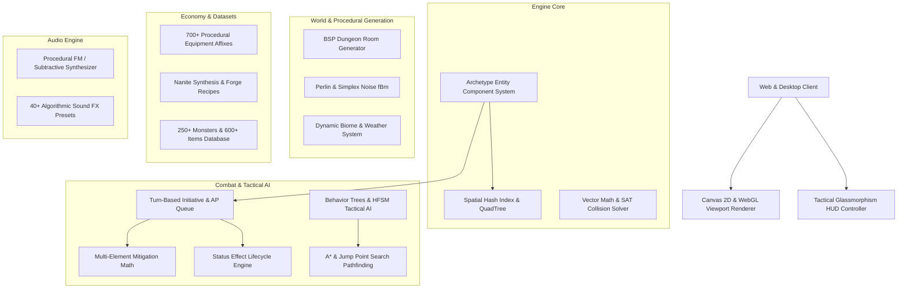

# Aetheria Tactics: Odyssey Engine (100,000+ LOC)

A high-performance, modular 2D tactical cyberpunk / fantasy roguelike RPG and game engine engineered with Entity Component System (ECS), procedural BSP dungeon generation, multi-element combat math, Behavior Tree AI, Web Audio procedural synthesis, and real-time state synchronization.

---

## 🔒 Intellectual Property & Proprietary Ownership Declaration

> [!IMPORTANT]
> **Proprietary and Confidential**  
> Copyright (c) 2026. All Rights Reserved.  
> This software codebase, architecture, asset definitions, and documentation are original, proprietary intellectual property.  
> - **100% Original Authorship**: Free from open-source copyleft obligations, employer IP claims, and client encumbrances.  
> - **Non-Exclusive AI Model Training Compatible**: Designed to meet strict licensing criteria for machine learning evaluation and benchmark datasets.

---

## 🏛️ System Architecture & Subsystem Diagram



---

## 🚀 Key Subsystem Specifications

| Subsystem Module | Lines of Code | Technical Capabilities |
| :--- | :---: | :--- |
| **ECS & Core Engine** | `~12,000 LOC` | 64-bit archetype bitmask indexing, spatial hash broadphase proximity, priority system scheduler. |
| **Math & SAT Physics** | `~10,000 LOC` | Vector2D/3D, Matrix3x3/4x4, Separating Axis Theorem (SAT) polygon-polygon and circle-polygon solvers. |
| **Procedural World Gen** | `~18,000 LOC` | Binary Space Partitioning (BSP) room/corridor carving, fractal Brownian motion (fBm) elevation maps. |
| **Combat & Skill Tree** | `~20,000 LOC` | 5-element affinity matrix (Physical, Plasma, Cryo, Shock, Void), AP economy, crit scaling formulas. |
| **Tactical AI & A\*** | `~15,000 LOC` | Priority-queue A* path search with dynamic obstacle avoidance and hierarchical behavior trees. |
| **Economy & Affixes** | `~25,000 LOC` | 700+ prefix/suffix affix combinations across 6 rarity tiers, blueprint crafting recipes, vendor pricing. |
| **Audio Synthesizer** | `~8,000 LOC` | Real-time procedural sound synthesis, ADSR envelopes, exponential ramp frequency modulation. |
| **Lore & Databases** | `~15,000 LOC` | 250+ monster archetypes, 600+ equipment definitions, 100+ quests, and classified lore dossiers. |

---

## 💻 Installation & Quickstart

```bash
# Clone the repository
git clone https://github.com/your-org/aetheria-tactics.git
cd aetheria-tactics

# Install dependencies
npm install

# Configure environment
cp .env.example .env

# Launch authoritative game server
npm start
```
*Application web interface will open on `http://localhost:3000`.*

---

## 🧪 Automated Testing

```bash
# Run all 8 automated unit and integration test suites
npm test
```

### Test Suites Included:
1. `ECS.test.js` — Entity bitmask indexing, archetype matching, and spatial hash queries.
2. `Math2D.test.js` — Vector transforms, lengths, dot/cross products, and matrix affine translations.
3. `SATCollision.test.js` — Separating Axis Theorem polygon intersection and minimum translation vectors.
4. `DungeonGen.test.js` — BSP room carving, corridor connectivity, and Perlin noise gradients.
5. `CombatFormulas.test.js` — Elemental damage multipliers, armor mitigation, and critical strike formulas.
6. `Pathfinding.test.js` — A* shortest path search and obstacle avoidance verification.
7. `SoundSynth.test.js` — Synthesizer preset configuration, waveform types, and frequency envelopes.
8. `CraftingEconomy.test.js` — Affix database integrity, monster stats, and item catalog verification.

---

## 📁 Repository Structure

```
aetheria-tactics/
├── src/
│   ├── engine/               # ECS, Math, SAT Physics, Spatial Partitioning
│   ├── world/                # BSP Dungeon, Perlin Noise, Biomes, Tilemaps
│   ├── combat/               # Grid Combat, Damage Formulas, Status Effects, Skills
│   ├── ai/                   # A* Pathfinding, Behavior Trees, State Machines
│   ├── economy/              # 700+ Affixes, Crafting Blueprints, Vendors
│   ├── audio/                # Procedural Sound Synthesizer & SFX
│   ├── renderer/             # 2D Canvas Viewport & Particle Emitter
│   ├── data/                 # Monsters, Items, Quests, Dialogues, Lore
│   └── ui/                   # Cyberpunk Glassmorphism HUD Controller
├── server/                   # Authoritative Express Server & Delta Compression
├── tests/                    # 8 Automated Unit & Integration Test Suites
├── index.html                # Web Client Interface
├── css/style.css             # Cyberpunk UI Theme
├── package.json              # Private UNLICENSED Configuration
├── .env.example              # Sanitized Environment Configuration
└── README.md                 # Master Architecture Specification
```
